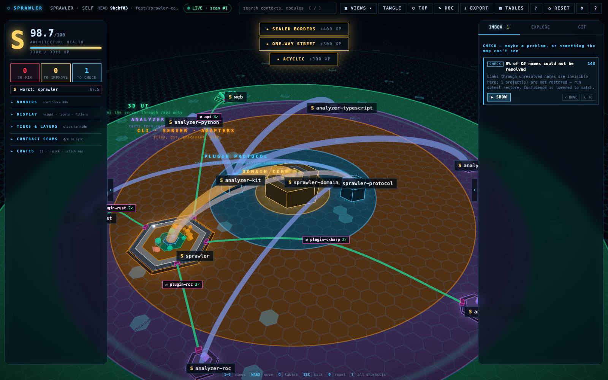
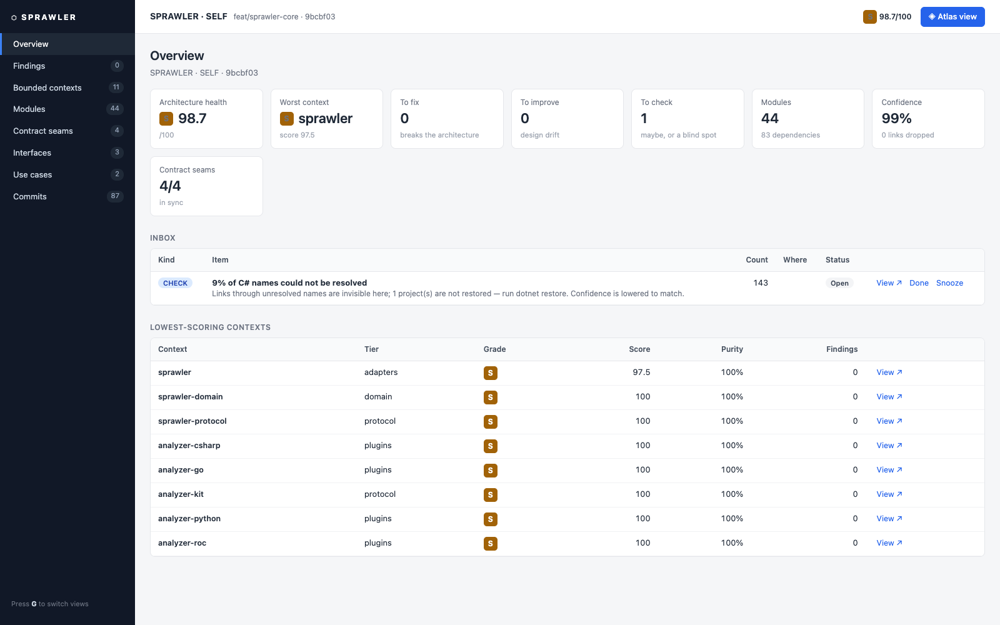

# Sprawler

[](https://github.com/clankernative/sprawler/actions/workflows/ci.yml)
[](sprawler.toml)
[](LICENSE)
[](https://www.rust-lang.org)

See how your whole codebase connects. Sprawler draws a local, interactive 3D map of a codebase —
contexts, files and every link between them — and checks it against the architecture your team
says it wants. Tangles, cycles, hub files and rule breaks stop being buried, and every finding
comes with why it matters and how to fix it.



- **A health score you can trust.** Findings come from rules your team writes (layers, what may
  depend on what, bounded contexts) plus structural signals (cycles, tangle, hubs). Every score
  shows its confidence; with too little evidence the grade is withheld (`?`).
- **Recommendations you can act on.** A short FIX / IMPROVE / CHECK inbox, each item with its `why`
  and a self-contained fix prompt you can hand to an agent. `sprawler check` gates CI.
- **Any language, through plugins.** Each language is a separate executable speaking a small JSON
  protocol ([docs/PROTOCOL.md](docs/PROTOCOL.md)). First-party: Rust, Roc, TypeScript/JavaScript,
  Python, Go and C# (Roslyn). Anyone can add one without touching the core.
- **Architecture as packs.** Policy lives in TOML packs a profile extends: `ddd-hexagonal`, with
  `cqrs` and `vertical-slices` add-ons, and platform packs such as `clankernative`.
- **Built for people and agents.** The UI, `--json` output and fix prompts all read the same
  findings. Agents: start at [AGENTS.md](AGENTS.md).

Everything runs on your machine; the UI is served on `127.0.0.1`. Nothing is uploaded.

## Install

Prebuilt (Linux, macOS):

```sh
curl -fsSL https://raw.githubusercontent.com/clankernative/sprawler/main/install.sh | sh
```

From source (needs Rust 1.85+; the C# plugin also needs the .NET SDK):

```sh
git clone https://github.com/clankernative/sprawler && cd sprawler
./install.sh                 # the core + the analyzer plugins your toolchains support
sprawler doctor              # what's available, and how to fix what isn't
```

Or step by step:

```sh
cargo install --path crates/sprawler                       # the core: one binary, UI built in
sprawler plugin add rust roc typescript python go csharp   # the analyzers you need
sprawler plugin list
```

Plugins install into `~/.local/share/sprawler/plugins` (`SPRAWLER_PLUGIN_HOME` to change it).
The Rust plugin resolves modules itself; [Graphify](https://pypi.org/project/graphifyy/)
(`uv tool install graphifyy`) adds Rust symbol counts.

## Quick start

```sh
sprawler check ~/work/my-repo                # works with no profile: structure-only score
sprawler serve ~/work/my-repo                # the 3D map at http://127.0.0.1:8766, live rescans
```

With no profile, the installed plugins map the repo (a Rust crate or Roc package per context) and
score its structure. To check it against your design, write a profile:

```sh
sprawler profile init ~/work/my-repo --architecture ddd-hexagonal --add cqrs
#   edit sprawler.toml: confirm each [[map]] entry's layer, add your team's [[rules]] with a `why`
sprawler profile validate ~/work/my-repo
sprawler profile explain ~/work/my-repo      # which entry placed which files; fallbacks flagged
sprawler check ~/work/my-repo --json       # exit 1 on major findings (default --fail-on major)
sprawler prompts ~/work/my-repo --index 0    # a fix prompt for one finding
```

Clankernative workspaces and `.csproj` repos are recognised automatically; `sprawler setup DIR`
shows what it found and `--yes` saves it.



## Use it in CI

```yaml
# .github/workflows/sprawler.yml
on: [pull_request]
jobs:
  sprawler:
    runs-on: ubuntu-latest
    steps:
      - uses: actions/checkout@v4
      - uses: clankernative/sprawler@v0.3
        with:
          plugins: rust roc typescript          # analyzers to install (prebuilt)
          baseline: sprawler-baseline.json      # optional: fail only on new findings
```

Findings show up as annotations on the PR diff, with a summary on the job page. An existing
codebase can start with `sprawler baseline .` (commit the file) so only new findings fail the check.

Add a badge: `sprawler badge . -o sprawler.json` writes a [shields.io](https://shields.io/badges/endpoint-badge)
endpoint file, e.g. `sprawler | S 98.8 · ddd-hexagonal` (or `· structure` with no profile). This
repo's CI publishes its own to a `badges` branch on every push to `main`.

## Commands

| Command | What it does |
|---|---|
| `serve` | Scan, serve the UI, rescan on file changes (`--port`, `--no-watch`) |
| `check` | Score, what to fix first, and the next command (`--baseline`, `--format github`). Exit 1 on findings at or above `--fail-on` (default `major`; `none` to only report), `--min-score N`, or unhandled contract seams (`--json`) |
| `report` | Score, contexts, seams, warnings (`--json`) |
| `scan` | Write the atlas JSON (`-o`, schema `sprawler.atlas/1`) |
| `prompts` | Agent-ready fix prompts (`--rule`, `--index`) |
| `baseline` / `badge` | Record today's findings for `check --baseline` / write a README badge |
| `profile init` / `validate` / `explain` | Start a profile, check it, see why files land where they do |
| `pack add` / `remove` / `list` | Install and list rules packs |
| `plugin add` / `remove` / `list` / `test` | Install and list analyzers; conformance check for a plugin |
| `discover` / `setup` | What auto-discovery finds / propose and save a workspace config |
| `doctor` | Which analyzers and tools are available |

Exit codes: `0` ok · `1` check failed or nothing matched · `2` usage or setup error.

## Packs

| Pack | What it adds |
|---|---|
| `ddd-hexagonal` | Layers core, port, application, driving and driven adapters, root; dependencies point inward |
| `cqrs` | Command and query layers; reads never import writes |
| `vertical-slices` | Slices never import siblings; `shared` never knows its slices |
| `clankernative` | The Clankernative platform (Roc SDK + Rust host): tiers, SDK/host seams, operations view |

```toml
# sprawler.toml
extends = ["ddd-hexagonal", "cqrs"]
name = "shop"
root = "."

[[map]]
glob = "src/{ctx}/domain/**"
tier = "app"
layer = "core"

[[rules]]
id = "billing-knows-shipping"
from_ctx = "billing"
to_ctx = "shipping"
severity = "major"
message = "Billing uses Shipping internals"
why = "Contexts talk through published contracts so they can change independently."
```

Every key is documented in [docs/CONFIG.md](docs/CONFIG.md).

Packs are built in, and also published separately at
[clankernative/sprawler-packs](https://github.com/clankernative/sprawler-packs):
`sprawler pack add <name> --from <that checkout>` installs a newer version.

## Layout

| Path | What |
|---|---|
| `crates/sprawler-domain` | Pure core: classification, judging, scoring, findings. No I/O |
| `crates/sprawler-protocol` | The analyzer plugin contract |
| `crates/sprawler` | CLI, server, profile and pack loading, plugin runner, git history |
| `plugins/` | First-party analyzers: separate executables, found at runtime |
| `packs/` | Architecture and platform packs (built in, and installable with `sprawler pack add`) |
| `web/` | UI source (Three.js); the built copy in `crates/sprawler/web_dist` is embedded in the binary |
| `sprawler.toml` | Sprawler's own rules (it extends `ddd-hexagonal`); `sprawler check . --fail-on minor` must pass |

Contributing: [CONTRIBUTING.md](CONTRIBUTING.md). Security: [SECURITY.md](SECURITY.md).
Changes: [CHANGELOG.md](CHANGELOG.md).

## License

MIT — see [LICENSE](LICENSE). Graphify (Apache-2.0) is a separate tool the Rust plugin can use; it
is not bundled.
